# MatchMyMovies

Coder Academy - T3A2 - Full Stack Application - Part A

## R1 - Description
### Purpose
- This app helps you find the perfect movie to watch based on your mood or a specific situation. It solves the common problem of decision fatigue, making the process of choosing a movie both fun and easy.

### Features
- Genre combiner (select two genres that generate a list of movies that match both genres)
- Movie pairing  (input two movies to generate a movie recommendation based on those two movies)
- Random movie generator (“pick for me” feature that fetches a random movie recommendation rom a variety of genres)
- Movie details (click on a movie from the list to see more details like the plot summary, actors, director and ratings)
- Light and Dark mode toggle

### Target Audience
- The app is for anyone who enjoys movies but wants help with the endless options available. By focusing on simplicity and fun, it can appeal to both occasional viewers and more passionate cinephiles.

### Tech Stack
- Frontend: React (Vite)
- Backend: Node.js, Express.js
- Database: MongoDB
- API: TMDb/OMDB
- Other Tools: Figma for design, Trello for planning, Excalidraw for diagramming

---

## R2 - Dataflow Diagram
Context Level 0 Diagram:

The diagrams below shows the interaction within the MatchMyMovies app. The user starts by selecting genres or options, which are sent to the Frontend (React). The frontend then sends an HTTP request to the Backend (Node.js + Express). The backend processes the request by fetching the necessary data from the Movie API. Once the data is retrieved, the Movie API returns the movie information to the backend, which then responds to the frontend. The frontend displays the movie list to the user.

If the user clicks on a movie to get more details, the Frontend sends a request to the Backend. The backend again interacts with the Movie API to fetch the movie details. The Movie API returns the details to the backend, which in turn sends the data back to the frontend for display to the user.

In addition to handling user requests, the Backend also caches popular requests and stores analytics data in the Database (MongoDB). This helps improve the efficiency of the application by reducing redundant calls to the external movie API and providing data for analysis.

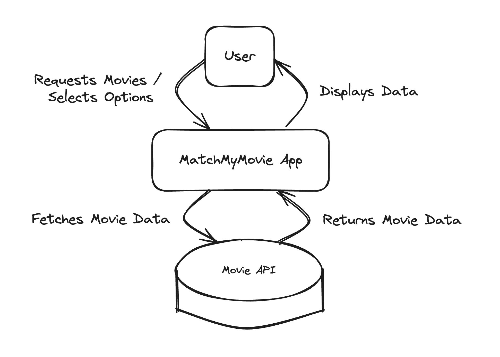  

Detailed Level 1 Diagram:  

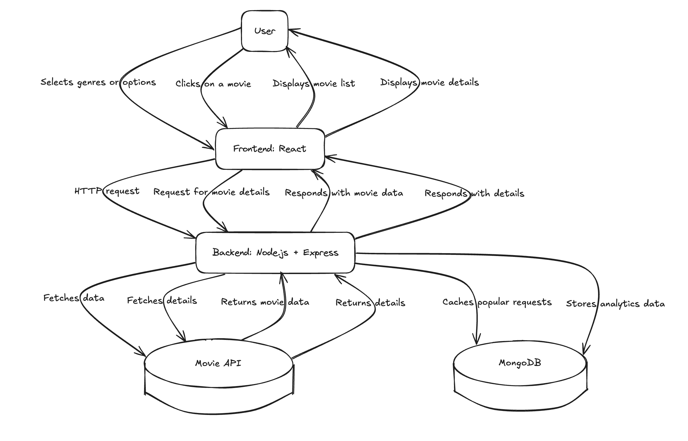  

---

## R3 - Application Architecture Diagram

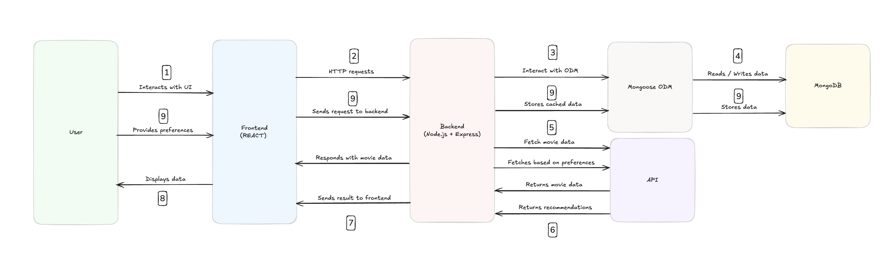

User Interaction with Frontend:

1. The User starts by interacting with the React Frontend. This can include actions such as selecting movie genres, requesting recommendations, or clicking on a specific movie for more details. The Frontend is responsible for capturing user inputs and displaying the results returned from the backend.

Frontend to Backend Communication:

2. When the user initiates an action, the Frontend sends an HTTP request to the Backend, which is built using Node.js and Express. This request can include information such as the selected genre or movie that the user wants to explore.

Backend to Mongoose:

3. The Backend uses Mongoose, which is an Object Data Modeling (ODM) library for MongoDB. Mongoose acts as a bridge between the backend and the MongoDB database, allowing the backend to easily read, write, and validate data. For example, when a request comes in, the backend may need to check if data is already cached in MongoDB by interacting with Mongoose.

Mongoose Interaction with MongoDB:

4. Mongoose interacts directly with MongoDB to store or retrieve data. This can include storing cached movie data, user preferences, or analytics. Mongoose uses schemas to ensure that all data adheres to a defined structure, making interactions with MongoDB more consistent and reliable.

Backend to External Movie API:

5. If the requested data is not available in MongoDB, the Backend sends an HTTP request to an external Movie API. This is done to retrieve the most up-to-date movie information, such as details about a specific movie or a list of movies in a particular genre.

External API Response:

6. The External Movie API processes the request and returns the required movie data to the Backend. This data may include movie titles, ratings, summaries, cast information, etc.

Backend Response to Frontend:

7. The Backend processes the data received from the External API (or MongoDB, if the data was cached) and sends it back to the Frontend. The backend may also cache some of the fetched data in MongoDB using Mongoose to optimise future requests.

Frontend Displays Data to User:

8. The Frontend then takes the response from the backend and displays it to the User. This could be in the form of a list of movies, detailed movie information, or recommendations based on user input.

User Preferences and Caching:

9. When the user provides preferences, such as selecting favorite genres or movies, this information is sent to the Backend. The backend, in turn, interacts with Mongoose to store this information in MongoDB for future use. This helps in providing a personalised experience and reduces redundant API calls by caching popular requests.

--- 

## R4 - User Stories 
### User Story 1: May (Casual Viewer) 
> "As a casual viewer, she wants to use a "pick for me" button to randomly generate a movie suggestion, So that she can quickly decide on a movie without spending too much time searching and dealing with sign-up processes".

#### Background:
Maya loves relaxing with a good movie after a busy day at work, but she often gets overwhelmed by endless scrolling on streaming platforms. She enjoys experimenting with new genres but isn’t always sure where to start.

#### Needs:
- A quick and easy way to get movie recommendations without wasting time creating an account.
- A tool to combine genres like "Romance + Comedy" or "Drama + Mystery" to find interesting options.
- A fun, random movie generator for when she doesn’t know what she’s in the mood for.

#### Pain Points:
- Decision fatigue from too many options on streaming platforms.
- Lack of a simple way to discover movies that match her preferences.

### User Story 2: Miles (Movie Enthusiast)
> "As a movie enthusiast, I wants to combine two genres to get movie recommendations that match both, So that I can find unique movies that align with my diverse interests without the hassle of signing up".

#### Background:
Miles is a self-proclaimed movie buff who loves exploring connections between films. He often hosts movie nights with friends and enjoys finding thematic pairings that blend different styles or genres.

#### Needs:
- A feature to combine two movies to get unique recommendations for double features.
- A platform that helps him explore lesser-known titles within his favorite genres.
- A random movie suggestion feature to keep his watchlist fresh and surprising.

#### Pain Points:
- Spending hours researching movies to fit a specific theme for his movie nights.
- Difficulty discovering obscure or underrated films in niche genres.

### User Story 3: Mave (Nostalgic Movie Lover) 
> "As a nostalgic movie lover, I want to input specific movies I love to generate recommendations with similar themes or tones, So that I can relive the excitement of my favorite classics and discover new movies with a similar vibe without unnecessary friction".

#### Background:
Mave enjoys revisiting movies that hold nostalgic value for him and exploring new films with similar vibes. He often wants to relive the excitement of classics like Jurassic Park or The Matrix but doesn’t know where to start finding complementary movies.

#### Needs:
- A feature to input specific movies he loves to generate recommendations with similar themes or tones.
- Suggestions for double features that evoke the same mood or spirit as his favorite classics.
- A quick way to create a "movie night experience" centered around familiar favorites and their modern counterparts or lesser-known films.

#### Pain Points:
- Spending too much time searching for movies that match the feel of his favorites.
Frustration with generic recommendations that don’t align with the style or theme he enjoys.
- Mave would use the Movie Pairing feature to input two movies and get tailored recommendations for titles that match his mood, helping him relive the magic of his favorite films while discovering new ones in the process.

---

## R5 - Wireframes
### Desktop
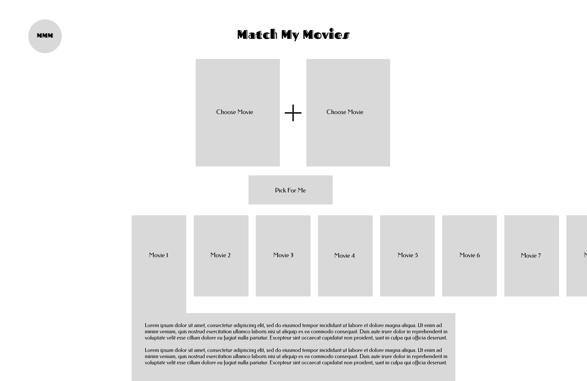
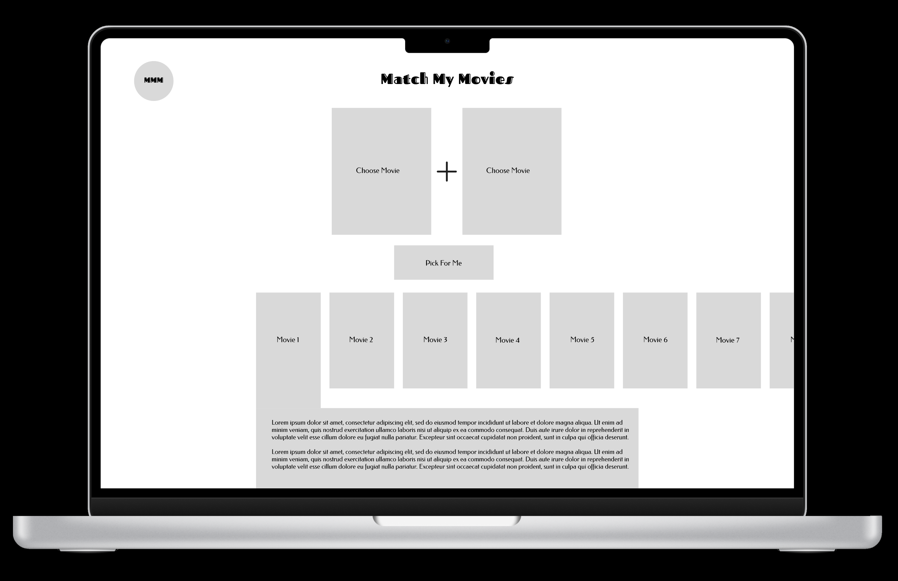

### Tablet
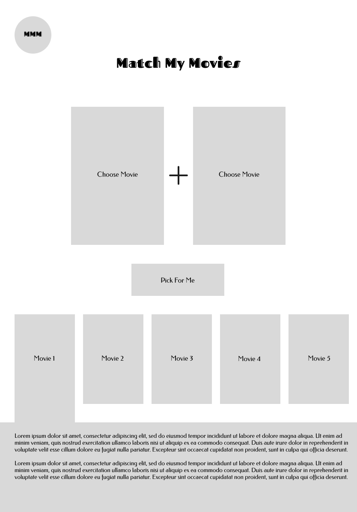
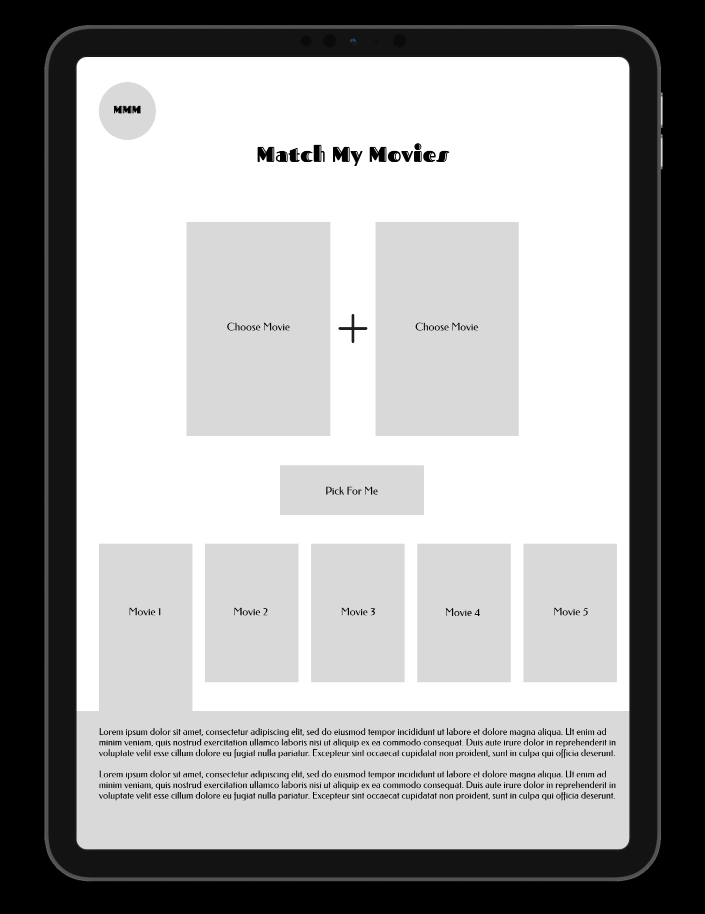

### Mobile
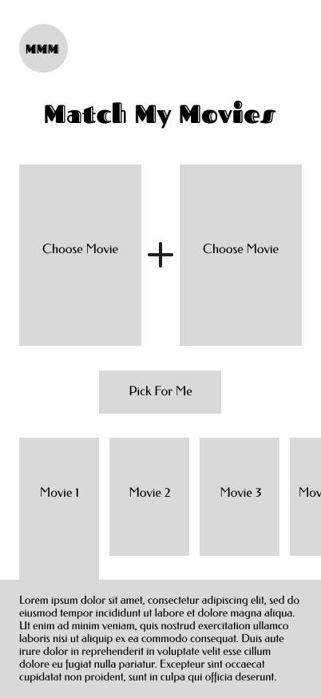 
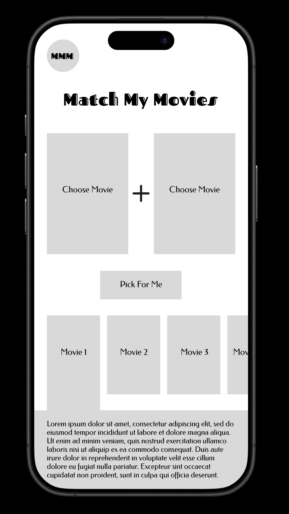

---

## R6 - Planning Board Screenshots

[Trello Board](https://trello.com/invite/b/673b27539a433905d52c2fbc/ATTI29fc651cb65c6291986d9f7403a7989558F983A5/coder-academy-t3a2-full-stack-app-part-a)

### Initial Board
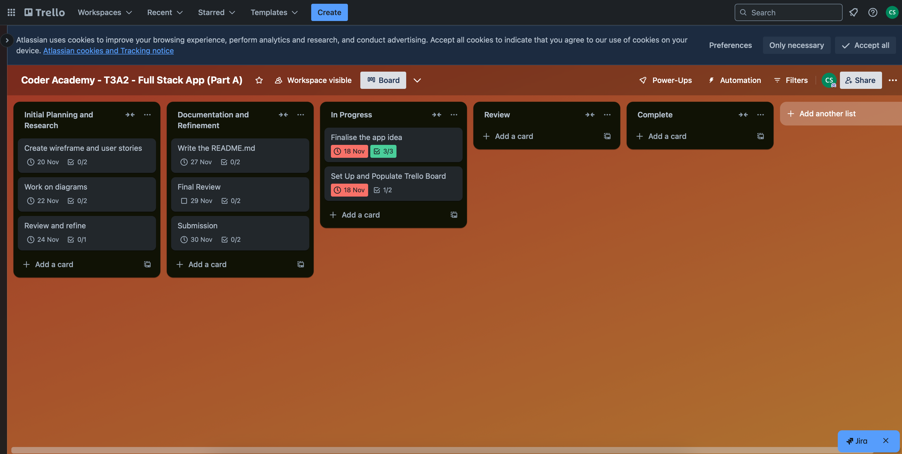

### Midway Board
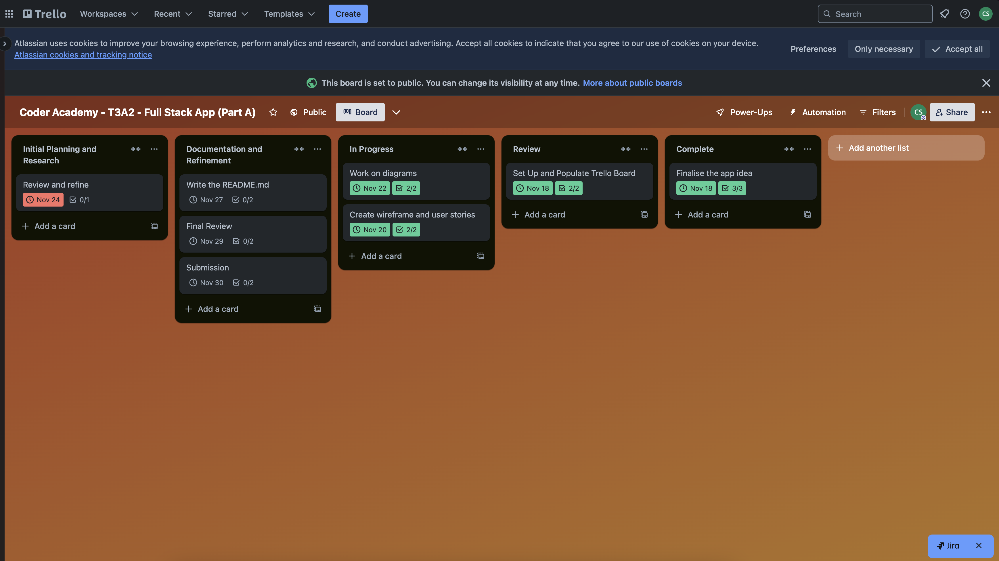
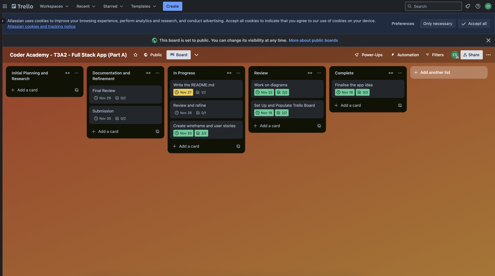

### Final Board
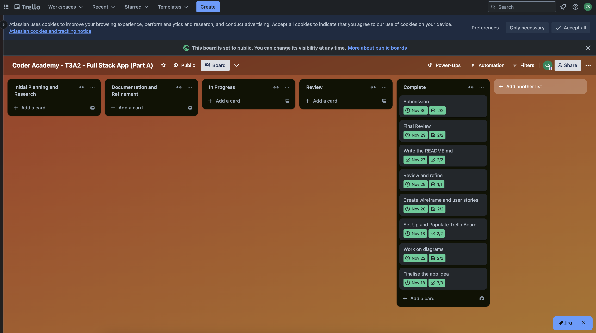

